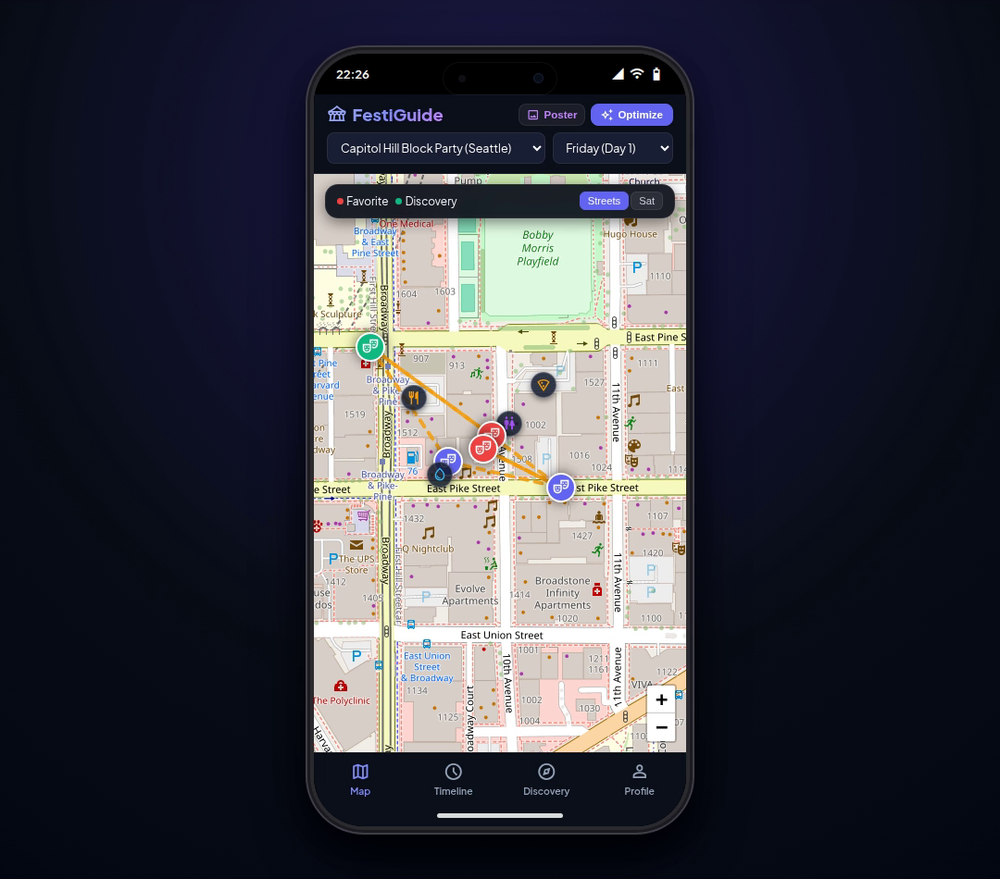
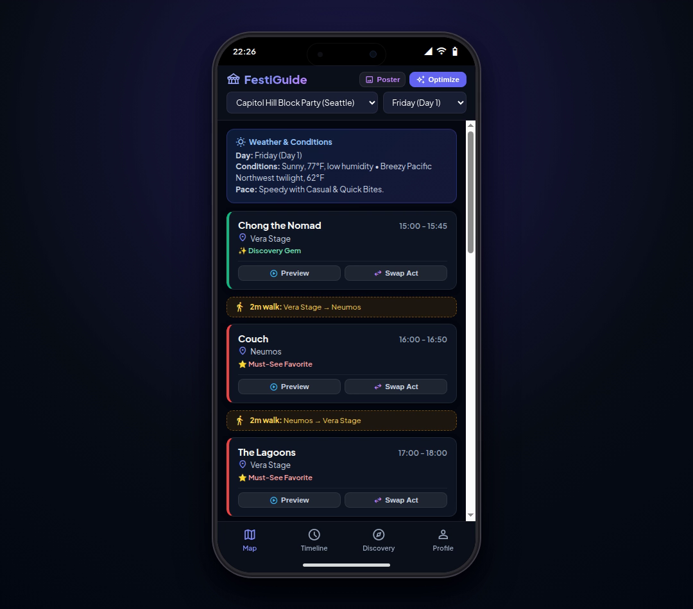
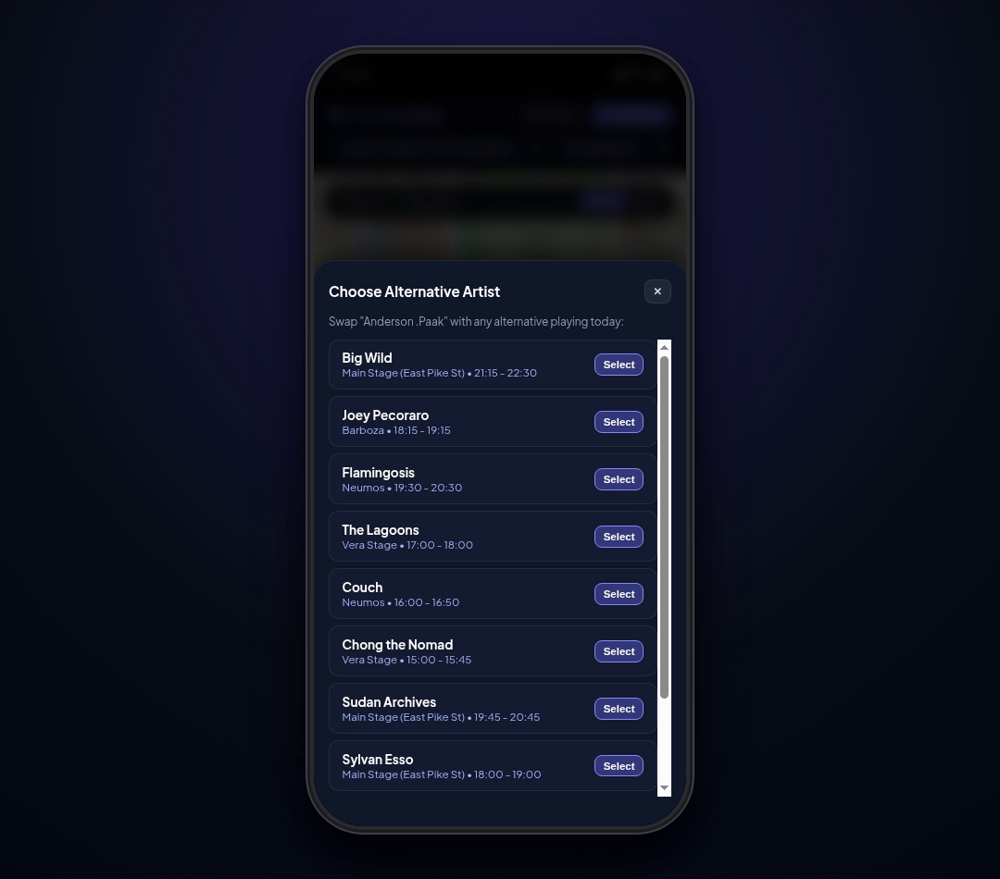
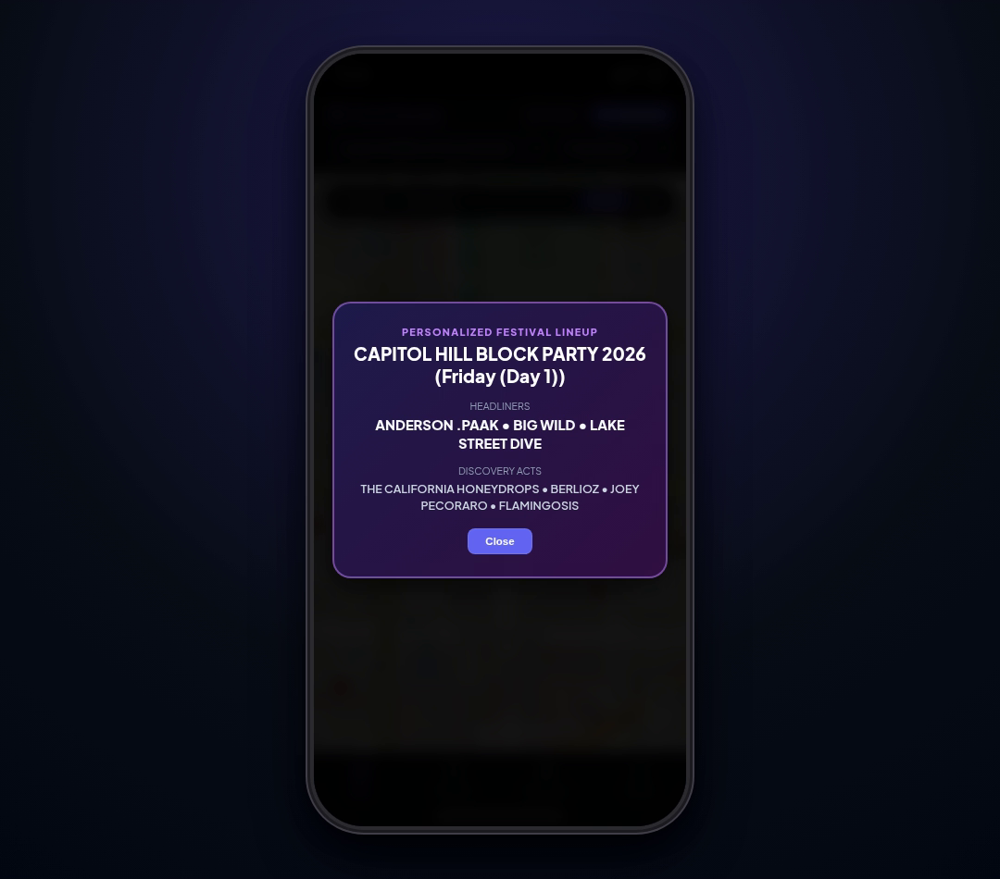

# 🎪 FestiGuide: Personalized Festival Routing & Music Discovery

<div align="center">



### An AI-powered, mobile-first festival companion that creates your dream music schedule, routes stages in real-time on interactive maps, and discovers hidden gem artists based on your Spotify taste.

[](https://deepmind.google/technologies/gemini/)
[](https://cloud.google.com/vertex-ai)
[](https://fastapi.tiangolo.com)
[](https://leafletjs.com)
[](https://opensource.org/licenses/MIT)

</div>

---

## 🌟 Overview

Music festivals are exhilarating, but planning them can be overwhelming: overlapping set times, rushing between distant stages without water, and missing great undercard acts you would love.

**FestiGuide** is an intelligent mobile web application designed to solve festival fatigue. It pairs your personal music taste (liked artists and preferred genres) with real festival stage timetables, venue GPS coordinates, and walking speeds to generate the ultimate stress-free festival itinerary.

---

## 📱 Visual Showcase & Features

| 🗺️ Stage & Map Routing | ⏱️ Personalized Timeline |
|---|---|
|  |  |
| **High-Res Street & Satellite Navigation**: Live Leaflet map with stage pins, GPS path polylines, and water/food amenities. | **Transit Buffers & Wellness Breaks**: Real-time walking duration calculations between stages and scheduled meal/hydration rest stops. |

| 🔄 Dynamic Lineup Swaps | 🎨 Custom Lineup Poster |
|---|---|
|  |  |
| **Alternative Artist Swapping**: Don't want to see a specific act? Tap "Swap Act" to pick any other real artist playing that festival day. | **Shareable Lineup Card**: Generates a stylized festival poster highlighting your personal headliners and discovery gems. |

---

## ⚡ Core Capabilities

- 📱 **Native Mobile Design**: Styled in an authentic iPhone 15 Pro hardware frame with a Dynamic Island, iOS status bar, and bottom navigation bar.
- 🎵 **30-Second Audio Previews**: Tap any artist on your schedule or discovery list to instantly preview their top track via the iTunes Search API in a docked mini-player.
- 🧠 **Cross-Session Attendee Memory**: Remembers your walking speed (Speedy, Moderate, Leisurely), food/drink rest preferences, and favorite artists in Firestore.
- 📅 **Multi-Day Lineups Supported**:
  - **Capitol Hill Block Party 2026** (Seattle, WA)
  - **Coachella 2026** (Indio, CA)
  - **Outside Lands 2026** (San Francisco, CA)
  - **Lollapalooza 2026** (Chicago, IL)

---

## 🎥 Video Walkthrough

A complete 1-minute narrated walkthrough demo showcasing the mobile app, map routing, audio previews, and alternative artist picker is included in this repository:

👉 **[`festiguide_demo.mp4`](festiguide_demo.mp4)**

---

## 🚀 Getting Started Locally

### Prerequisites
- Python 3.10+
- `uv` or `pip`

### 1. Clone the Repository
```bash
git clone https://github.com/alicechang29/buildwithgemini-festiguide.git
cd buildwithgemini-festiguide
```

### 2. Run the App
```bash
cd frontend
pip install -r requirements.txt
python main.py
```

### 3. Open in Browser
Visit **`http://localhost:8000`** in your browser to experience FestiGuide!

---

## 🏗️ Architecture

```
buildwithgemini-festiguide/
├── frontend/
│   ├── main.py                # FastAPI server (lineups, profile, preview endpoints)
│   ├── static/
│   │   ├── index.html         # iPhone 15 Pro mobile UI with Leaflet map
│   │   └── manifest.json      # PWA standalone mobile manifest
├── simple-agent/
│   ├── app/agent.py           # Gemini Reasoning Engine & ADK agent
│   └── scripts/               # Firestore multi-day festival seeding scripts
├── festiguide_demo.mp4        # Narrated video demo
└── docs/images/               # App screenshots
```

---

## 📄 License
This project is open-source under the MIT License.
